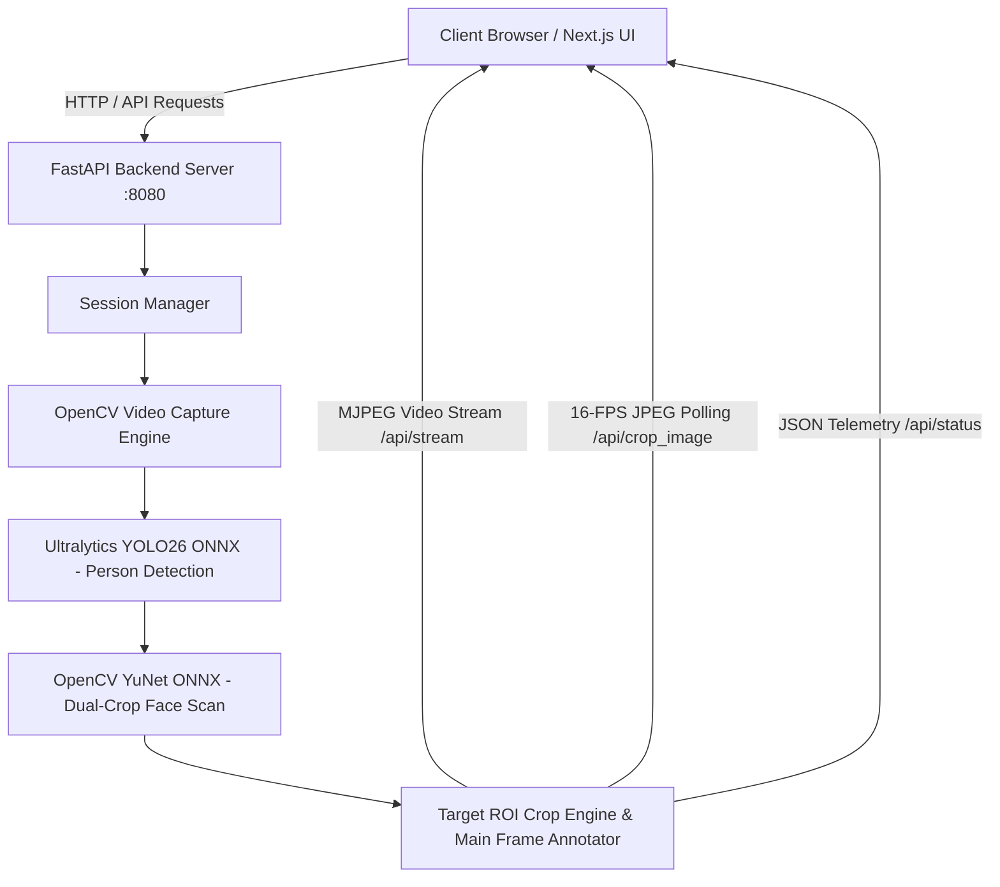

# YOLO26 Tracker Studio — Complete Technical Architecture & Implementation Guide

## Executive Overview

**YOLO26 Tracker Studio** is a high-performance, real-time object tracking and target inspection platform built with a **100% Pure Python FastAPI** backend and a **Next.js 16 (Turbopack)** frontend. The application delivers real-time person detection, camera-driven face recognition, live target Region of Interest (ROI) cropping, and interactive telemetry at 30–60 FPS on Apple Silicon hardware.



---

## 1. System Architecture & Transition from C++ to Pure Python

### Evolution & Architectural Decisions

In earlier iterations of this project, a native C++ engine (`backend/src/` containing `main.cpp`, `object_tracker.cpp`, `yolo_detector.cpp`, `lapjv.hpp`, and `CMakeLists.txt`) was built to achieve minimal latency. While C++ provided low overhead, it introduced significant drawbacks:

1. **Toolchain & Cross-Platform Friction**: Requiring CMake, C++ compilers (`g++`/`clang`), OpenCV C++ headers (`httplib.h`), and LAPJV linear assignment libraries created complex build setup requirements across different developer machines and operating systems.
2. **Maintenance Complexity**: Managing multi-threaded video decoding, mutex locks, and custom memory buffers in C++ reduced developer velocity without providing speed advantages over optimized PyTorch/ONNX C++ bindings.

### The 100% Pure Python FastAPI Engine Advantage

The codebase was refactored into a **Pure Python FastAPI Server** (`backend/app.py`). Under the hood, PyTorch and Ultralytics execute C++ and Apple Silicon Metal GPU (`mps`) kernels compiled directly to native machine code. This architecture offers:

- **Zero-Compilation Instant Startup**: Runs out-of-the-box via `venv/bin/python backend/app.py` or `./dev.sh`.
- **Identical High-FPS Performance**: Achieves **sub-12ms inference latency** and **25–60 FPS** video playback on Apple Silicon M-series chips.
- **Robust Session Management**: Provides isolated session state management (`SessionState`), dynamic video source switching, and lock-free concurrency.

| Component | Stack / Technologies | Key Responsibilities |
| :--- | :--- | :--- |
| **Backend Engine** | Python 3.11+, FastAPI, Uvicorn, OpenCV Python, PyTorch, Ultralytics YOLO, ONNX Runtime | Video decoding, real-time YOLO object detection, YuNet face scanning, frame annotation, MJPEG streaming, session isolation. |
| **Frontend UI** | Next.js 16 (Turbopack), React 19, TypeScript, Vanilla CSS, Lucide Icons | Responsive interactive video dashboard, real-time target inspector, strictness controls, live diagnostic logs console. |
| **Hardware Acceleration** | Apple Silicon Metal GPU (`mps`), CoreML Execution Provider | Hardware-accelerated neural network inference on M1/M2/M3/M4 Apple Silicon GPUs. |

---

## 2. Neural Model Pipelines & Person Detection

### Ultralytics YOLO ONNX Pipeline (`yolo26s.onnx`)

- **Class Filtering**: Person class ONLY (`class_id == 0`). Non-person classes (cars, chairs, objects) are strictly filtered out during inference.
- **Model Warmup**: To eliminate lazy ONNX CoreML graph compilation delays on the first incoming request, the backend performs a **startup dummy frame warmup** (`640x640` tensor pass) before port `8080` is opened.
- **Execution Mode**: Direct `model.predict(source=infer_rgb, conf=0.20, iou=0.45)` operating on RGB matrices resized to $640 \times 640$.

```python
# Direct Ultralytics YOLO Prediction for Person Detection
infer_mat = cv2.resize(frame, (640, 640), interpolation=cv2.INTER_LINEAR)
infer_rgb = cv2.cvtColor(infer_mat, cv2.COLOR_BGR2RGB)

results = model.predict(
    source=infer_rgb,
    conf=session.conf_threshold, # Default: 0.20
    iou=session.nms_threshold,   # Default: 0.45
    verbose=False,
    device="mps"                 # Apple Silicon Metal GPU Acceleration
)
```

---

## 3. Face Detection & Target ROI Crop Engine

### OpenCV YuNet ONNX Face Detector (`face_detection_yunet_2023mar.onnx`)

Face detection is executed continuously across active tracked person crops using the OpenCV YuNet ONNX face detector.

#### Dual-Region Crop Scan Strategy
To handle surveillance and hallway camera angles where full-body crops ($108 \times 198\text{ px}$) distort aspect ratios when scaled to neural inputs, YuNet performs a **dual-pass scan**:
1. **Full-Body Crop Scan**: Scans the entire person bounding box matrix.
2. **Upper Head Crop Scan**: Extracts and scans the top **55% upper region** of the person crop where faces are upright and undistorted.

```python
# Dual-Region Crop Scanning for Maximum Face Detection Accuracy
crops_to_check = [(person_crop, "full", 0)]
if c_h >= 30 and c_w >= 20:
    head_h = max(20, int(c_h * 0.55))
    head_crop = person_crop[0:head_h, 0:c_w].copy()
    crops_to_check.append((head_crop, "head", 0))
```

#### Face-Driven Pink Bounding Box Rule
- **Person Box Color Rule**: A tracked person's bounding box turns **BRIGHT PINK / MAGENTA (`#DD00FF` / `RGB(220, 0, 255)`) ONLY when a face is detected on that person by the camera**.
- **Cyan Face Box**: Inside the pink box on the main video frame and on the right target inspection crop, a **BRIGHT CYAN** rectangle with label `Face XX%` (e.g. `Face 87%`) is drawn directly around the face.
- **Global Coordinate Mapping**: Face bounding box coordinates detected inside person crops $(f_x, f_y, f_w, f_h)$ are translated back to global main frame space:
  $$\text{main\_fx}_1 = b_x + f_x, \quad \text{main\_fy}_1 = b_y + f_y + y_{\text{offset}}$$

```python
# Map face box coordinates to main video frame!
m_fx1 = bx + fx
m_fy1 = by + fy + y_offset
m_fx2 = bx + fx + fw
m_fy2 = by + fy + y_offset + fh
main_frame_faces.append((m_fx1, m_fy1, m_fx2, m_fy2, sc_pct))
```

#### 1.5-Second Target ROI Persistence Memory
To prevent target selection dropouts or black screen flickering when a person momentarily turns their head or blinks, the backend maintains a **1.5-second persistence buffer** (`session.last_face_time`).

---

## 4. Concurrency, Locking & Low-Latency Streaming

### Lock-Free Video Processing Loop (`process_session_frame`)

To prevent Uvicorn worker threads from stalling during `/api/status` or `/api/source` API calls, thread locks (`session.lock`) are acquired strictly for microsecond primitive reads/writes. Heavy operations (OpenCV file decoding, YOLO inference, and YuNet detection) execute **lock-free**:

```python
# Lock acquired ONLY for state snapshot
with session.lock:
    cap_obj = session.cap
    src_fps = session.source_fps
    last_tick = session.last_frame_tick

# Lock-Free Frame Decoding & Neural Inference
ret, frame = cap_obj.read()
```

### High-Speed Zero-Proxy-Buffer Target ROI Inspector (`/api/crop_image`)

Rather than streaming `multipart/x-mixed-replace` (which gets buffered by Next.js dev proxies), the right inspector panel uses rapid 16-FPS single JPEG polling (`/api/crop_image?sid=...&t=...`), bypassing proxy buffers entirely and delivering zero-latency updates.

```typescript
// Rapid 16-FPS Image Polling in CroppedInspector.tsx
useEffect(() => {
  if (selectedTrackId === -1) return;
  
  let isMounted = true;
  const updateSrc = () => {
    if (!isMounted) return;
    setImgUrl(`/api/crop_image?sid=${SESSION_ID}&t=${Date.now()}`);
  };

  updateSrc();
  const interval = setInterval(updateSrc, 60); // 16 FPS high-speed polling
  return () => { isMounted = false; clearInterval(interval); };
}, [selectedTrackId]);
```

---

## 5. Process Lifecycle & Robust Startup (`dev.sh`)

The system uses `./dev.sh` to manage backend and frontend process lifecycles:

1. **Port Cleanup**: Kills stale processes bound to ports `8080` (FastAPI) and `3000` (Next.js) using `lsof -ti:8080 | xargs kill -9`.
2. **Signal Trapping**: Intercepts `SIGINT`, `SIGTERM`, and `EXIT` to clean up child background threads gracefully.
3. **HTTP Health Check Polling**: Frontend launches *only* after FastAPI responds to HTTP health checks (`curl -s http://127.0.0.1:8080/api/status`), avoiding `ECONNREFUSED` proxy connection errors.

---

## 6. Smart File Path Resolution (`resolve_video_path`)

To handle user video uploads and file paths with spaces (e.g. `test/ videos_30fps.mp4`), `resolve_video_path` automatically sanitizes whitespace and matches files across `test/` and `uploads/` directories:

```python
def resolve_video_path(src: str) -> str:
    if not src:
        return "test/15690486_1920_1080_25fps.mp4"
    src_clean = str(src).strip()
    if os.path.exists(src_clean):
        return src_clean
    if os.path.exists(src):
        return src
    base = os.path.basename(src_clean)
    for folder in ["test", "uploads"]:
        if os.path.exists(folder):
            for root, _, files in os.walk(folder):
                for f in files:
                    if f == base or f.strip() == base or f.strip() == base.strip():
                        return os.path.join(root, f)
    return "test/15690486_1920_1080_25fps.mp4"
```

---

## 7. Summary of API Endpoints

| Endpoint | Method | Purpose |
| :--- | :--- | :--- |
| `GET /api/status` | GET | Returns real-time telemetry (FPS, inference latency, active tracks, face state). |
| `GET /api/stream` | GET | Streams live annotated MJPEG video (`multipart/x-mixed-replace`). |
| `GET /api/crop_image` | GET | Returns latest high-resolution JPEG crop of the selected target face/ROI. |
| `POST /api/source` | POST | Dynamic video source switcher (sample videos, user uploads, webcam, RTSP). |
| `POST /api/upload_chunk` | POST | Multi-threaded parallel chunk uploader (4MB chunks). |
| `POST /api/settings` | POST | Adjusts detection strictness (`conf_threshold`, `nms_threshold`). |
| `GET /api/logs` | GET | Retrieves system diagnostic event logs. |
