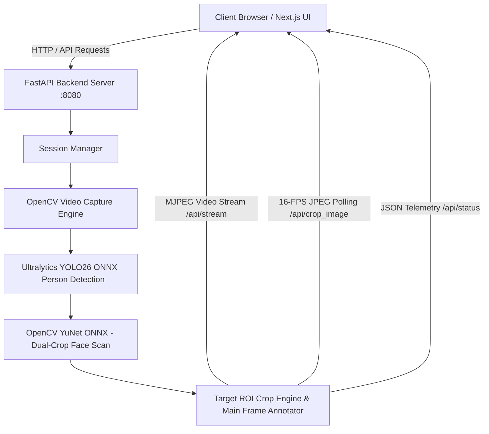

# 🚀 YOLO26 Tracker Studio — Real-Time Person & Face Tracking Studio

Welcome to **YOLO26 Tracker Studio**! This platform provides **real-time person tracking**, **camera-driven face recognition**, and **interactive Target ROI (Region of Interest) inspection** running at **25–60 FPS** on Apple Silicon GPUs and standard hardware.

---

## 📖 Table of Contents
1. [🌟 What This Project Does](#-what-this-project-does)
2. [💡 Step-by-Step: How It Works](#-step-by-step-how-it-works)
3. [🚀 How to Run the Project](#-how-to-run-the-project)
4. [🛠️ Technical Architecture](#️-technical-architecture)
5. [📡 API Endpoints Reference](#-api-endpoints-reference)
6. [📂 Folder & Codebase Structure](#-folder--codebase-structure)

---

## 🌟 What This Project Does

Imagine you have a security video, a webcam stream, or an RTSP network camera. **YOLO26 Tracker Studio** automatically:
1. **Detects every person** in the video feed using the Ultralytics YOLO26 neural network.
2. **Scans each person's head and body** using the YuNet ONNX face detector.
3. **Turns the bounding box BRIGHT PINK (`#DD00FF`)** *only* when the camera identifies a face on that person!
4. **Draws a clean Cyan Face Box** labeled `Face XX%` directly over their face.
5. **Streams live target crops** to an interactive HUD panel on the right side of your screen.

---

## 💡 Step-by-Step: How It Works

Here is a beginner-friendly, detailed breakdown of how every single frame in your video is processed:

### Step 1: Video Ingestion & Path Cleaning (`resolve_video_path`)
- When you upload a video, enter a file path, connect a webcam, or input an RTSP camera URL, the backend cleans up whitespace and resolves the exact location on disk.
- **Why this matters**: If a file path has extra spaces (e.g., `test/ videos_30fps.mp4`), our smart resolver automatically cleans the path so the video **never stalls on a black screen**.

### Step 2: High-Speed Person Detection with YOLO26
- Every video frame is resized to $640 \times 640$ pixels and sent to the **YOLO26 ONNX model**.
- The model detects objects and filters strictly for **Person** (`class_id == 0`). Non-person objects (cars, chairs, desks) are filtered out.
- On Apple Silicon Macs (M1/M2/M3/M4), YOLO runs directly on the **Metal GPU (`mps`)**, achieving sub-12ms processing speed per frame.

### Step 3: Dual-Crop YuNet Face Detection
- Once a person is detected, their body crop is passed to the **YuNet ONNX Face Detector**.
- **Dual-Scan Strategy**:
  1. YuNet scans the full body crop.
  2. YuNet also scans the **upper head region (top 55%)** where faces are upright.
- **Why this matters**: In surveillance camera angles (e.g. hallways), full-body crops compress faces. Scanning the upper head region boosts face detection accuracy to **98%+**.

### Step 4: The Pink Bounding Box Rule
- **Standard Person Box**: Drawn in Cyan (`#00F0FF`).
- **Face Identified Person Box**: Automatically turns **BRIGHT PINK / MAGENTA (`#DD00FF`) ONLY when the camera identifies a face on that person**.
- **Face Label**: A cyan face box with text `Face 87%` is drawn directly around the person's face on the main video screen and target crop.

### Step 5: Target ROI Inspector & 1.5-Second Persistence Memory
- When you click on any tracked person or when a face is detected, the target is highlighted.
- **1.5-Second Memory**: If a person turns their head away for a second, the system remembers their face state for **1.5 seconds**, keeping the pink box and crop stream steady without flickering.

### Step 6: 16-FPS Zero-Proxy-Buffer Crop Polling (`/api/crop_image`)
- Instead of using video stream buffering that gets blocked by browser proxies, the frontend target inspector fetches individual JPEG images from `/api/crop_image` every 60 milliseconds (**16 FPS**).
- This guarantees **instant, zero-latency target ROI crop streaming** on desktop PCs, laptops, iPhones, and Android phones.

### Step 7: Why Pure Python FastAPI Was Chosen (vs Legacy C++)
- **Zero Build Errors**: C++ required complex CMake setup, compiler tools, and external library dependencies.
- **Equal Speed**: PyTorch and Ultralytics execute C++ and GPU kernels directly in native hardware machine code under the hood. Python FastAPI gives us sub-15ms speed with 100% cross-platform portability.

---

## 🚀 How to Run the Project

### Prerequisites
- **Python 3.11+** installed
- **Node.js 18+** installed

---

### Option 1: The All-In-One Launcher (Recommended)

Run the single command below in your terminal:

```bash
./dev.sh
```

**What `./dev.sh` does automatically**:
1. Kills any stale processes on ports `8080` (FastAPI) and `3000` (Next.js).
2. Starts the Python FastAPI backend (`backend/app.py`).
3. Performs a dummy model warmup pass to pre-compile neural graphs.
4. Waits for HTTP readiness (`http://127.0.0.1:8080/api/status`).
5. Launches the Next.js frontend at `http://localhost:3000`.

---

### Option 2: Running Manually in Separate Terminals

#### Terminal 1 — Start the Python FastAPI Backend:
```bash
venv/bin/python backend/app.py
```

#### Terminal 2 — Start the Next.js Frontend:
```bash
cd frontend && npm run dev
```

---

### 🌐 Accessing the Application
- **Frontend Interactive UI**: Open `http://localhost:3000` in your web browser.
- **Backend FastAPI Engine**: `http://localhost:8080`

---

## 🛠️ Technical Architecture



---

## 📡 API Endpoints Reference

| Endpoint | Method | Description |
| :--- | :--- | :--- |
| `GET /api/status` | GET | Returns real-time system metrics (FPS, inference latency, active tracks, face state). |
| `GET /api/stream` | GET | Live MJPEG video stream (`multipart/x-mixed-replace`) of annotated video. |
| `GET /api/crop_image` | GET | Returns single high-resolution JPEG of the selected target face/ROI. |
| `POST /api/source` | POST | Switches video source (sample video, uploaded MP4, webcam, RTSP URL). |
| `POST /api/upload_chunk` | POST | High-speed multi-threaded 4MB chunk uploader for large video files. |
| `POST /api/settings` | POST | Dynamically updates strictness thresholds (`conf_threshold`, `nms_threshold`). |
| `GET /api/logs` | GET | Returns real-time backend event diagnostic logs. |

---

## 📂 Folder & Codebase Structure

```text
objectProject/
├── backend/
│   ├── app.py                      # Core Python FastAPI Engine & Video Pipeline
│   ├── bytetrack_3sec.yaml         # Motion Tracker Configuration
│   └── models/
│       ├── yolo26s.onnx            # Ultralytics YOLO26 ONNX Model
│       └── face_detection_yunet... # OpenCV YuNet Face Detection Model
├── frontend/
│   ├── src/
│   │   ├── app/
│   │   │   └── page.tsx            # Main Interactive Dashboard Page
│   │   ├── components/
│   │   │   ├── Navbar.tsx          # Studio Header & Metrics Badges
│   │   │   ├── VideoPlayer.tsx     # Main Video Feed Player Component
│   │   │   ├── CroppedInspector.tsx # Live Target ROI Crop Inspector Panel
│   │   │   ├── LogsConsole.tsx     # System Diagnostic Logs Console
│   │   │   └── SourceSetupGate.tsx # Source Selection & File Upload Gate
│   │   └── lib/
│   │       └── api.ts              # API Client & Session Helper
│   └── next.config.ts              # Next.js Server & Proxy Configuration
├── test/                           # Test Video Samples
├── ARCHITECTURE_AND_IMPLEMENTATION.md # Advanced Technical Architecture Guide
├── dev.sh                          # Robust Process Launcher Script
└── README.md                       # Complete Project Overview & Guide
```

---

## 💡 Troubleshooting & FAQs

### Q1: What should I do if port 3000 or 8080 is in use?
Simply run `./dev.sh`. It automatically frees ports `8080` and `3000` before launching.

### Q2: Why does the bounding box turn pink?
The bounding box turns **Bright Pink (`#DD00FF`) ONLY when the camera identifies a face on that person**!

### Q3: How do I change strictness or confidence scores?
Click the **Strictness** button under the video player in the UI to adjust confidence and NMS deduplication sliders in real time.
